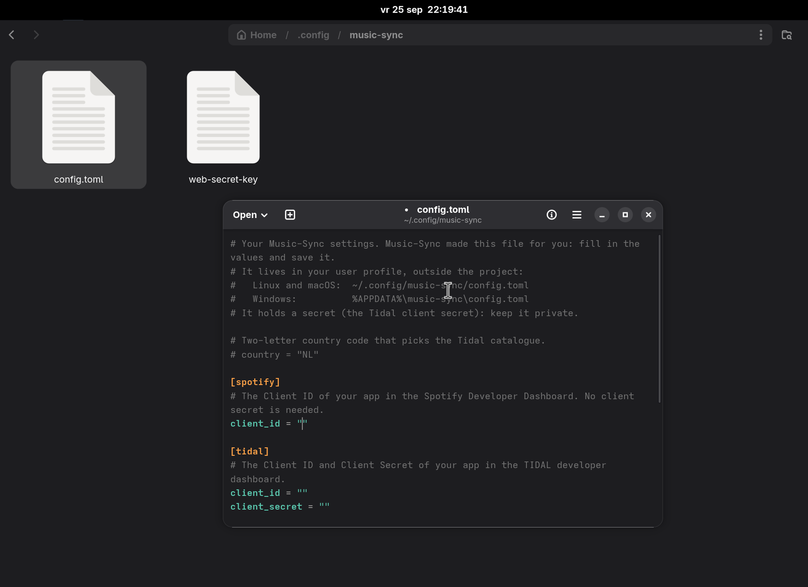

<p align="center">
  
</p>

<h1 align="center">Music-Sync</h1>

<p align="center">Move liked songs and playlists between Spotify, Tidal and CSV files.<br>From a web page on your own computer, or from the command line.</p>

| From \ to | CSV | Spotify | Tidal |
|-----------|-----|---------|-------|
| **Spotify** | `export` | | `transfer` |
| **Tidal** | `export` | `transfer` | |
| **CSV** | | `import` | `import` |

Music-Sync finds each track by its ISRC, or else by title, artist and length, and never takes a live version for the studio one. Running it twice does not add tracks twice. It only handles playlist data, never audio.

## Installation

You need Python 3.14 or newer.

```bash
git clone https://github.com/Stensel8/Music-Sync
cd Music-Sync
python3 -m venv .venv
source .venv/bin/activate        # Windows (PowerShell): .venv\Scripts\Activate.ps1
pip install -e '.[web]'
```

## Getting started

```bash
music-sync web
```

Open <http://127.0.0.1:8888>. For each service you have not set up yet, the page shows where to create a developer app, what to fill in and where to paste its Client ID. Then log in, and you are ready.

Spotify only works with a Premium account; Tidal and CSV work without it. See [Setting up Spotify and Tidal](#setting-up-spotify-and-tidal) for the details.

## Usage

### In the browser

The dashboard has three parts: export to CSV, import a CSV, and transfer between the services. While it works it shows each step, how far it is and how long it will still take. The tracks it could not find are listed with the reason, and can be downloaded as a CSV.

### On the command line

```bash
music-sync login spotify                          # once per service
music-sync login tidal

music-sync transfer spotify tidal --liked         # liked songs, to a new playlist
music-sync transfer spotify tidal --playlist "Road trip"
music-sync export spotify --liked -o liked.csv
music-sync export tidal --all -o backup/          # liked songs and every playlist
music-sync import tidal liked.csv --playlist "From CSV"

music-sync status                                 # what is set up and logged in
music-sync doctor                                 # tries the real APIs
```

| Option | What it does |
|--------|--------------|
| `--dry-run` | Look everything up, change nothing |
| `--unmatched FILE` | Save the tracks that were not found to a CSV |
| `--min-score 0.8` | How sure a match must be (0 to 1) |
| `--to-playlist NAME` | The playlist to fill (transfer) |
| `-q` | No progress output |
| `-v` (before the command) | Log every API call, for a bug report |

`music-sync --help` and `music-sync transfer --help` show the rest.

## Setting up Spotify and Tidal

Music-Sync needs a developer app for each service, made from your own account. `music-sync web` walks you through it; these are the same steps.

### Spotify

> [!IMPORTANT]
> Since February 2026 Spotify's API only works for apps whose owner has **Premium**. Without it every request fails with HTTP 403. Someone with Premium can make the app and add you under *Settings > User Management*. See Spotify's [quota modes](https://developer.spotify.com/documentation/web-api/concepts/quota-modes) and [migration guide](https://developer.spotify.com/documentation/web-api/tutorials/february-2026-migration-guide).

1. Create an app in the [Spotify Developer Dashboard](https://developer.spotify.com/dashboard).
2. Redirect URI: `http://127.0.0.1:8888/spotify/callback` (`127.0.0.1`, not `localhost`).
3. Under *Which API/SDKs are you planning to use?* tick **Web API** only.
4. Copy the Client ID. The client secret is not needed.


Without Premium the dashboard shows this banner, and the Web API cannot be ticked:


### Tidal

1. Click *Create New App* in the [TIDAL developer dashboard](https://developer.tidal.com/dashboard).
2. Redirect URI: `http://127.0.0.1:8888/tidal/callback`.
3. Scopes: `collection.read`, `collection.write`, `playlists.read`, `playlists.write` and `user.read`.
4. Copy the Client ID and the Client Secret. The secret lets Music-Sync search Tidal's catalogue.


### The settings file

The first run creates it and prints where it is:

- Linux and macOS: `~/.config/music-sync/config.toml` (a hidden folder: open it by its path)
- Windows: `%APPDATA%\music-sync\config.toml`

Paste what you copied between the quotes and save. There is no need to restart: Music-Sync reads the file again when it changes.

```toml
[spotify]
client_id = "..."

[tidal]
client_id = "..."
client_secret = "..."
```



`country = "NL"` at the top picks the Tidal catalogue; without it your system's country is used. The environment variables `SPOTIFY_CLIENT_ID`, `TIDAL_CLIENT_ID`, `TIDAL_CLIENT_SECRET` and `MUSICSYNC_COUNTRY` take priority over the file. Your logins are kept next to it in `tokens.json`: keep that file private.

## How tracks are matched

A track is found by its id on the target service (a CSV exported from it), else by its ISRC, else by searching for title and artist. Each search result gets a score from 0 to 1: half for the title, 0.4 for the artist and 0.1 for the length. From 0.8 on (`--min-score`) it is a match.

Remaster notes, "feat." parts, spelling and punctuation do not count. Another version does: live, remix, acoustic, instrumental, sped up, "(Taylor's Version)" and the like, and other numbers ("Part 1" is not "Part 2"). A track that is not found says why:

| Reason | What it means |
|--------|---------------|
| not on Tidal | Nothing by this artist came up: probably not in your country's catalogue |
| only other songs on Tidal | The artist is there, this song is not |
| only another version | Only a live version, remix and the like |
| score too low for a match (0.75, needs 0.80) | Close, but not sure enough; often the length differs |

## CSV format

| Column | Contents |
|--------|----------|
| `title` | Track title (the only column that is required) |
| `artists` | Artists, separated by `;` |
| `album` | Album title |
| `duration_ms` | Length in milliseconds |
| `isrc` | ISRC, the most reliable way to find a track again |
| `spotify_uri` / `tidal_id` | The track's id on that service |

Files must be UTF-8. The column names of other exporters (`Track Name`, `Artist Name(s)`, ...) work too, and a file without a header row is read as `artist,title`.

## Good to know

- Spotify only lets apps read playlists you own or collaborate on, not the ones you follow. Music-Sync skips those, and empty playlists, and says so.
- A transfer to Tidal is fast (20 ISRCs per request); one to Spotify takes a request per track.
- The web interface is for one person on their own computer. It only listens on `127.0.0.1`; never expose it to a network.
- Tidal's API is young. If something fails, add the output of `music-sync doctor tidal` to your issue.

## Development

```bash
pip install -e . --group dev
pytest
ruff check . && ruff format --check . && pyright
vulture && bandit -r musicsync -ll
```

CI runs the same checks, plus `pip-audit`.

## License and credits

[AGPL-3.0](LICENSE).

Music-Sync grew out of csv2tidal, started by [Nugman](https://github.com/Nugman) and roland.behme, who also chose the license. Their script was inspired by [RZetko](https://gist.github.com/RZetko/71801a20188e842ef03bed3b6d7a297f) and used login code from [spotify_to_tidal](https://github.com/timrae/spotify_to_tidal) by [Tim Rae](https://github.com/timrae).
